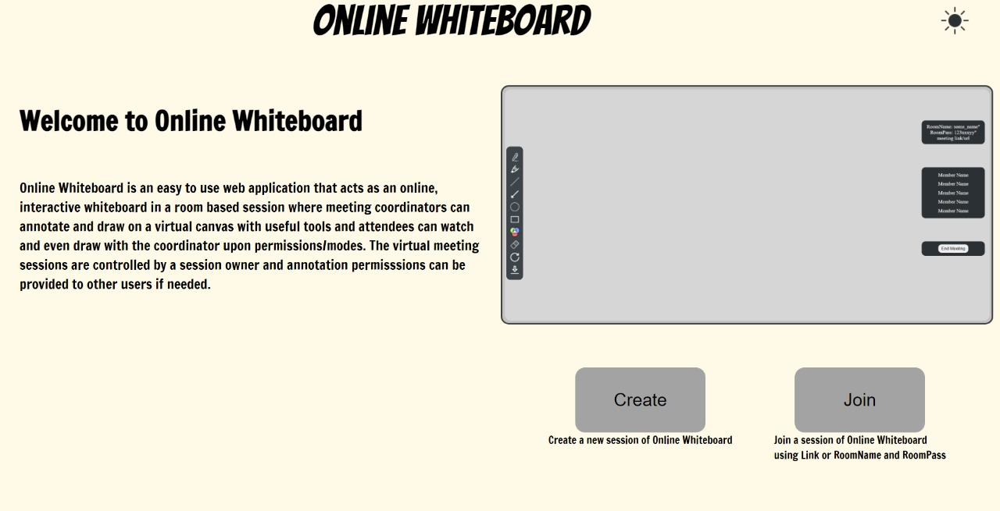
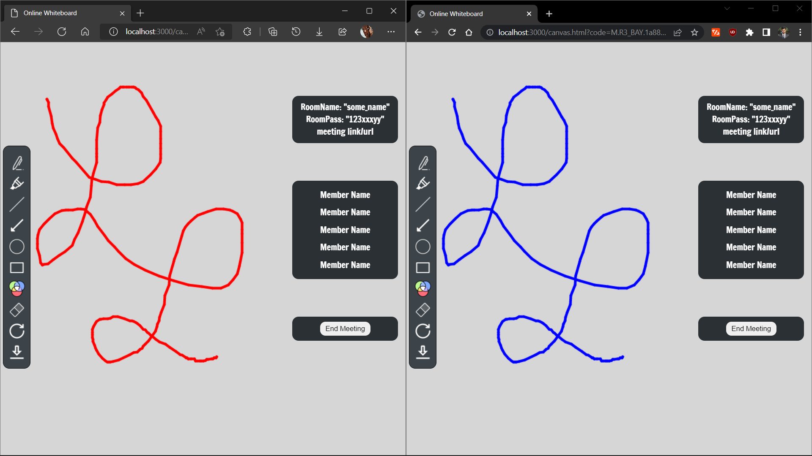

# Online Whiteboard

Online Whiteboard is an easy to use web application that acts as an online, interactive whiteboard in a room based session where meeting coordinators can annotate and draw on a virtual canvas with useful tools and attendees can watch and even draw with the coordinator upon permissions/modes. The virtual meeting sessions are controlled by a session owner and annotation permisssions can be provided to other users if needed.

## Table of Contents

- [Requirements](#requirements)
- [Usage](#usage)
- [Contributions](#contributions)

## Requirements

### Minimum Requirements
    Operating System : Windows 7+ / MacOS X+ / Ubuntu 18.04+
    Processor : Dual Core Pentium @ 1.3GHz/ AMD Athlon 3000G
    RAM : 4 GB
    Storage : 128GB
    Connectivity : 512kbps
    Browser : Any Chromium based browser

## Usage

- Go to the website [OnlineWhiteboard](https://online-whiteboard-2022-cse-38.herokuapp.com/).
- As mentioned in this article, our project is a Web Application and works just like any website

<!-- - Welcome to Home Page
  - 
- Join a WhiteBoard Session or Create a new WhiteBoard Session
  - 
- Enter required credentials
  - 
- Draw freehand and it appears in real time to everyone in the session
  - 
- End Meeting or Leave Session
  -  -->

## Contributions

- Md Sujan - Development and Implementation
- Manvith P - UI/UX design and Documentation
- Nikhil Vasan - Testing and Documentation
